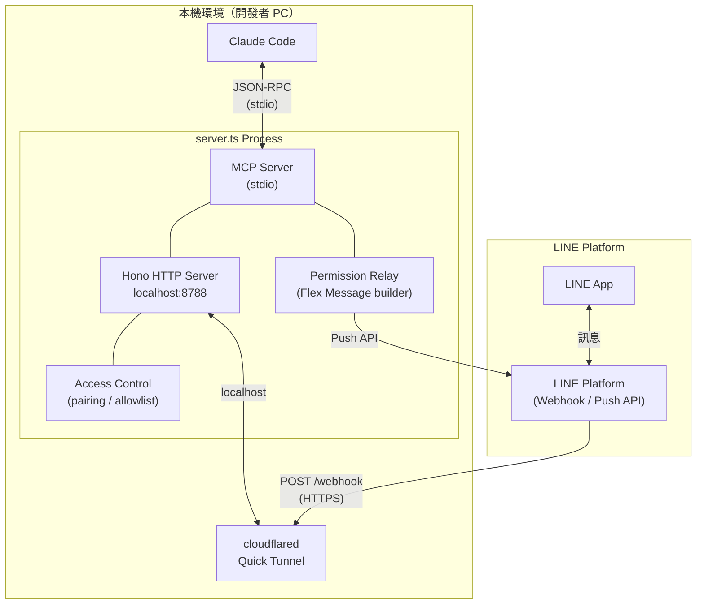
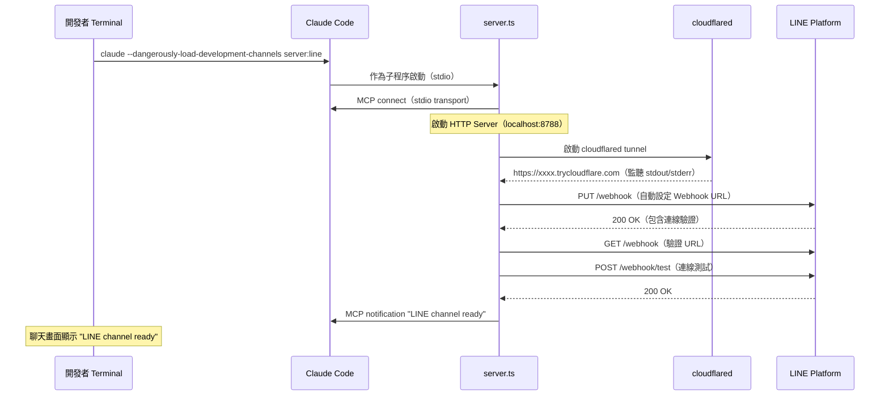
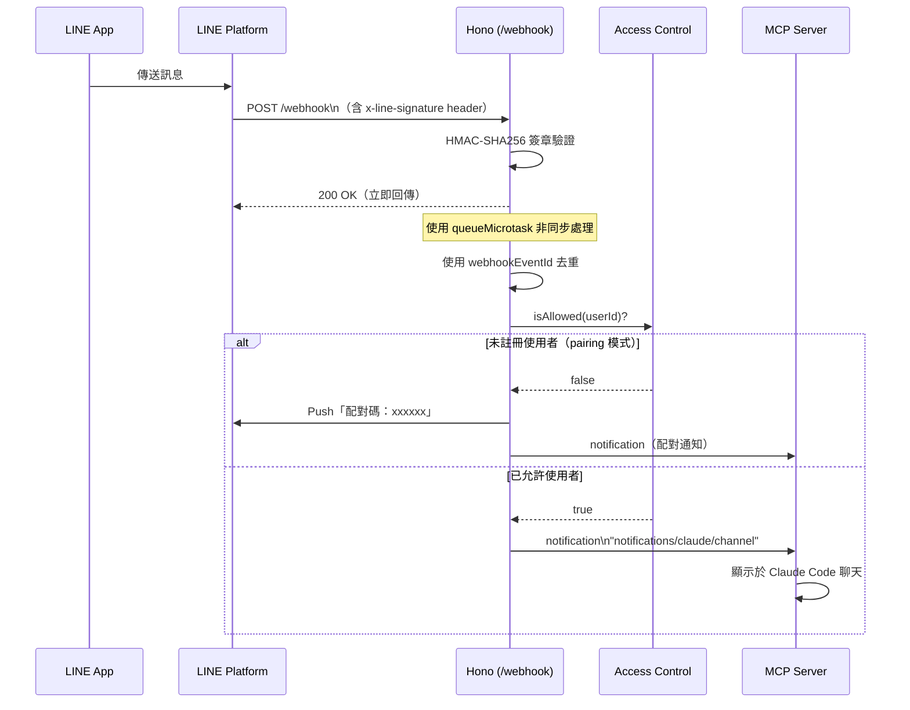
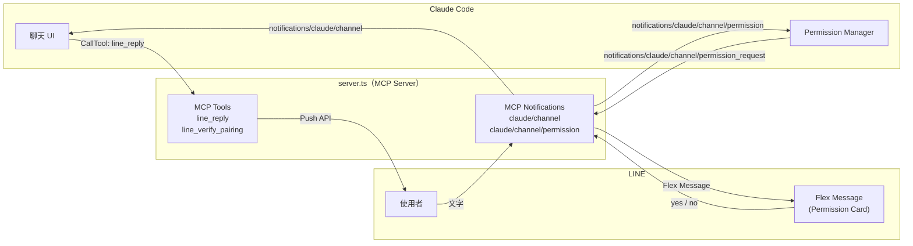
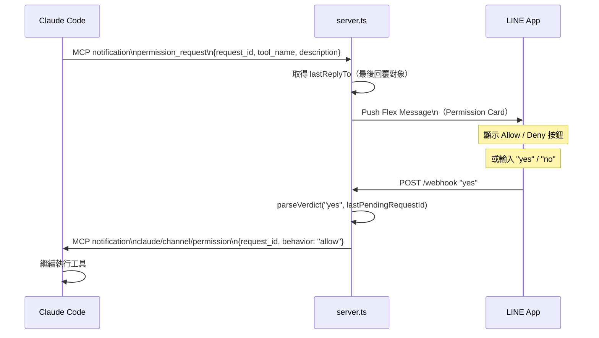
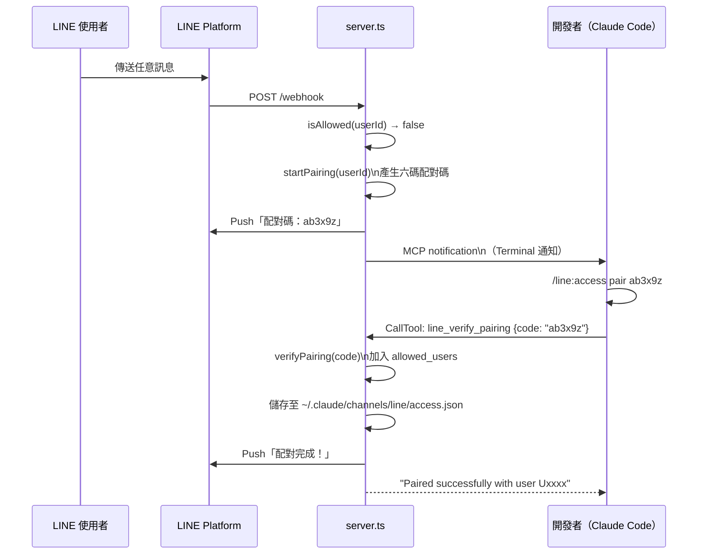
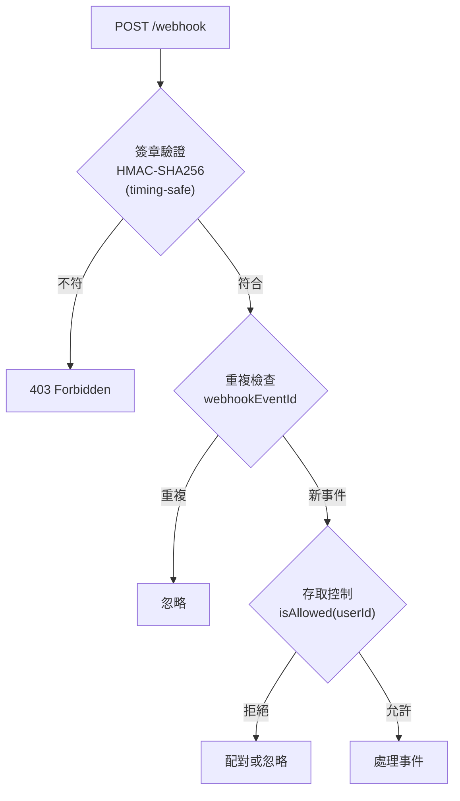
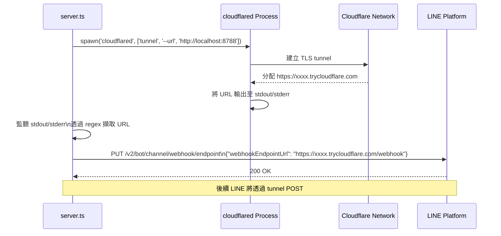

# line-to-cc 架構解說

此專案將 LINE Messaging API 實作為 **Claude Code 的 Custom Channel Plugin**，讓使用者可以直接透過 LINE 操作本機的 Claude Code Session。

---

## 整體架構



### 元件列表

| 元件                   | 技術                          | 功能                      |
| -------------------- | --------------------------- | ----------------------- |
| **MCP Server**       | `@modelcontextprotocol/sdk` | 與 Claude Code 之間的通訊橋接   |
| **HTTP Server**      | Hono on Bun                 | 接收 LINE Webhook         |
| **cloudflared**      | Quick Tunnel                | 將 localhost 對外公開為 HTTPS |
| **Access Control**   | in-memory + JSON            | 配對與 sender gating       |
| **Permission Relay** | Flex Message                | 將 Claude 的授權請求轉送到 LINE  |

---

## 啟動流程



> **設計重點**：先建立 MCP 連線，再設定 tunnel，這樣才能把「tunnel 已完成」通知送到聊天畫面。

---

## 訊息接收流程

以下是從 LINE 收到訊息，到顯示在 Claude Code 聊天中的完整流程。



### 為什麼要立即回傳 200

```
LINE 官方建議：Webhook 接收後需於 1 秒內回傳 200
→ 使用 queueMicrotask() 將處理拆成非同步
→ HTTP 層只負責驗證並立即回應
→ 真正事件處理放到下一個 microtask queue
```

---

## MCP Protocol 的應用

此專案的核心，是使用 MCP 實作 Claude Code 的 **Custom Channel 功能**。



### MCP 訊息列表

| 訊息                                                | 方向                   | 用途                      |
| ------------------------------------------------- | -------------------- | ----------------------- |
| `notifications/claude/channel`                    | server → Claude Code | 將 LINE 訊息送進聊天           |
| `notifications/claude/channel/permission_request` | Claude Code → server | 工具執行授權請求                |
| `notifications/claude/channel/permission`         | server → Claude Code | 回傳使用者 yes/no 判定         |
| `CallTool: line_reply`                            | Claude Code → server | 將 Claude 回覆 Push 到 LINE |
| `CallTool: line_verify_pairing`                   | Claude Code → server | 驗證配對碼                   |

> **重點**：`notifications/claude/channel` 是 Claude Code 的擴充功能。
> 透過 `capabilities.experimental['claude/channel']` 宣告 capability，讓 Claude Code 能辨識。

---

## Permission Relay 流程

當 Claude Code 需要執行高風險工具時，會將授權請求轉送到 LINE，由手機端確認。



### Verdict Parsing 規則

```
"yes abcde"   → 明確指定 request_id（5碼）
"no"          → 使用 bare verdict（採用 lastPendingRequestId）
"y"           → "yes" 簡寫
```

> 配對碼採用不含 `l` 的小寫 a-z 五碼。
> 避免手機鍵盤上 `l` 與 `1`、`I` 混淆。

---

## 配對流程

安全地加入首次使用者。



### 存取模式

| 模式          | 行為              |
| ----------- | --------------- |
| `pairing`   | 首次訊息自動發送配對碼（預設） |
| `allowlist` | 僅允許已配對使用者       |
| `disabled`  | 全部封鎖            |

---

## 安全性設計



| 防護                   | 實作                                                |
| -------------------- | ------------------------------------------------- |
| **簽章驗證**             | `crypto.subtle.verify`（WebCrypto API，timing-safe） |
| **Raw body 驗證**      | JSON parse 前先驗證原始位元資料                             |
| **Replay Attack 防護** | 使用 `webhookEventId` 去重（最多 1000 筆 in-memory）       |
| **網路隔離**             | HTTP Server 僅綁定 `127.0.0.1`                       |
| **程序隔離**             | 啟動 cloudflared 前先 kill 舊程序，避免 port 衝突             |

---

## cloudflared Quick Tunnel 機制

使用 Cloudflare 提供的免費功能，在沒有固定網域與認證的情況下，將 localhost 對外公開為 HTTPS。



> **注意**：Quick Tunnel 的 URL 每次程序重啟都會改變。
> 但因為會自動更新 LINE Webhook URL，因此幾乎沒有維運成本。

---

## 檔案結構

```text
src/
├── server.ts          # 協調器：MCP + HTTP + tunnel 啟動與整體 wiring
├── webhook.ts         # Hono：簽章驗證、去重、事件路由
├── line-api.ts        # LINE API client：push、webhook 設定
├── signature.ts       # HMAC-SHA256 簽章驗證（WebCrypto）
├── access-control.ts  # 配對、sender gating、allowlist 管理
├── permission.ts      # Verdict parsing + Flex Message builder
├── tunnel.ts          # cloudflared 啟動 + URL 擷取
└── types.ts           # LINE Webhook event type 與 type guard
```

---

## Tech Stack

| 技術                            | 選擇原因                          |
| ----------------------------- | ----------------------------- |
| **Bun**                       | 啟動速度快、內建測試工具、支援 Web API       |
| **Hono**                      | 輕量、型別安全、原生支援 Bun              |
| **@modelcontextprotocol/sdk** | 與 Claude Code 通訊必需            |
| **cloudflared**               | 免費、免驗證、自動 HTTPS               |
| **WebCrypto API**             | timing-safe 簽章驗證、無 Node.js 依賴 |
